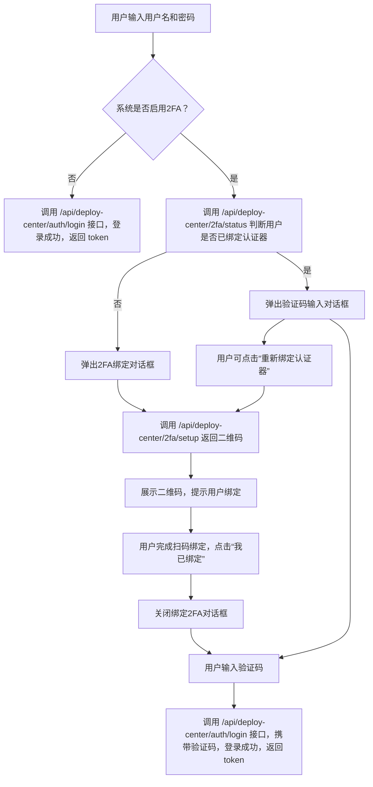

# Deploy Center 登录认证逻辑

##  简介

Deploy Center 登录采用用户名 + 密码登录，并在系统启用双因素认证（2FA）功能时，要求用户额外输入动态验证码进行身份校验，确保账户安全。支持动态重新绑定认证器，以应对设备丢失、验证码失效等情况。

>  你可以使用常见的双因素认证器进行绑定，如 **Microsoft Authenticator**、**Google Authenticator**、**阿里云App**等支持 TOTP 协议的应用。

---

##  登录逻辑流程图



---

##  接口说明

###  登录接口 `/api/deploy-center/auth/login`

**请求方式**：POST

**请求参数**：

```json
{
  "identifier": "用户名",
  "credential": "密码",
  "two_factor_code": "验证码（选填）"
}
```

**说明**：如果系统启用了 2FA 且用户已绑定，将强制要求提供 `two_factor_code`。否则提示验证码缺失或错误。

---

###  查询绑定状态 `/api/deploy-center/2fa/status`

**请求方式**：GET

**请求参数**：

```query
username=alice
```

**返回示例**：

```json
{
  "code": 200,
  "status": "success",
  "msg": null,
  "data": true
}
```

---

###  获取二维码 `/api/deploy-center/2fa/setup`

**请求方式**：POST

**请求参数**：

```json
{
  "username": "alice"
}
```

**返回示例**：

```json
{
  "code": 200,
  "status": "success",
  "msg": null,
  "data": {
    "secret": "ASFASFASFASFASF",
    "qr_code_base64": "data:image/png;base64,..."
  }
}
```

**说明**：已绑定过的用户也可重新绑定（覆盖旧 secret），前端通过「重新绑定认证器」入口调用此接口。

---

###  验证验证码 `/api/deploy-center/2fa/verify`

**请求方式**：POST

**请求参数**：

```json
{
  "username": "alice",
  "code": "123456"
}
```

**返回示例**：

```json
{
  "code": 200,
  "status": "success",
  "msg": null,
  "data": true
}
```

**说明**：扫码绑定完成后，可使用此接口验证用户输入的验证码是否正确。

---

##  前端设计要点

- 首次登录时判断系统是否开启 2FA，再判断用户是否已绑定
- 未绑定：调用 `/api/deploy-center/2fa/setup` 获取二维码进行绑定
- 已绑定：弹出验证码对话框
- 对话框中提供「重新绑定认证器」下划线样式按钮，引导用户重新生成二维码（点击后再次调用 `/setup`）
- 登录时只要验证码正确，即可完成登录流程

---

##  安全建议

- `/setup` 接口可以增加频率限制（防止暴力刷新二维码）
- 可记录绑定时间字段如 `two_factor_bound_at`
- 建议在“重新绑定认证器”前要求用户至少完成一次密码验证（增强安全性）

---

##  总结

Deploy Center 登录认证流程具备以下特点：

- 支持系统级启用或关闭 2FA
- 用户首次登录后可绑定 2FA 验证器
- 验证失败时支持自助重新绑定认证器
- 登录流程明确，接口设计合理，易于扩展
