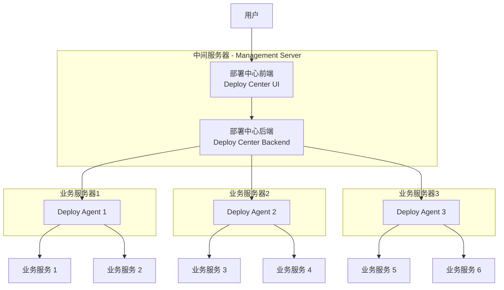

# 部署中心 (Deploy Center)

  
  
  
  
  

## 项目介绍

**`部署中心 (Deploy Center)`** 是一款轻量级的项目部署管理工具，它支持前端项目以及各类可通过 Docker 容器化部署的项目（如 Java、Python 等）。通过自动化和标准化操作，`Deploy Center` 能显著提升运维效率，降低人工干预成本，确保项目部署的高效性和稳定性。

## 功能特点
- **轻量级与高性能**：单个 `Deploy Agent` 在运行时仅占用不到 150MB 的内存，确保对业务服务器资源的占用极低，同时提供高性能的部署能力，适合从中小企业到大型企业的各种规模部署场景。
- **灵活的上传部署**：`Deploy Center` 提供强大的文件管理功能，支持用户将本地打包好的项目文件上传至系统，并通过 `Deploy Agent` 完成部署操作。系统支持上传文件的版本管理，用户可以方便地选择所需版本进行部署，整个过程无需人工干预，确保部署流程的高效性和可控性。
- **自动化云构建部署**：`Deploy Center` 支持从代码仓库（如 GitHub、GitLab）自动拉取代码，并在业务服务器上通过 Maven 进行本地构建和部署。整个流程由 `Deploy Agent` 自动完成，无需人工干预，实现从代码到部署的全流程自动化，显著简化部署流程，提升开发效率。
- **详细的部署日志**：提供全面的部署日志记录功能，用户可以实时查看每次部署过程中的详细信息，包括部署状态、执行命令、输出信息等。日志支持按时间、按项目等多维度查询，方便用户快速定位问题，确保部署过程的透明性和可追溯性。
- **完整的部署历史**：完整记录每次部署的详细信息，包括部署时间、部署版本、操作用户、部署结果等。用户可以通过部署历史快速回溯部署过程，对比不同版本的部署情况，并支持一键回滚到历史版本，确保部署的可追溯性和稳定性。
- **高级安全特性**：`Deploy Center` 提供高级安全特性，包括用户认证、权限管理、数据加密等，确保企业数据和部署流程的安全性。系统支持多用户登录，提供角色和权限管理功能，满足企业级的安全需求。
- **实时监控与告警**：提供实时监控功能，支持对项目运行状态的实时查看和分析。系统可以配置告警规则，及时通知运维人员潜在问题，确保项目的稳定运行。

## 项目架构

### 项目架构设计说明

#### Deploy Center
- **Deploy Center UI (部署中心前端)**：提供图形化界面，供用户进行操作，发送部署指令和管理任务。
- **Deploy Center Backend (部署中心后端)**：接收来自管理前端的请求，负责调度部署指令，并将指令下发到各个 **Deploy Agent**。同时负责整个系统的安全校验。

**Deploy Center** 部署在支持外网访问的中间服务器中，可以接收来自外部网络的请求。它是整个部署系统的管理和控制中心，负责接收用户指令、调度部署任务，并与各个 **Deploy Agent** 进行通信。

#### Deploy Agents
- **项目部署API**：部署在业务服务器上，对外暴露API完成项目的部署任务，其API无法直接调用，要通过**Deploy Center**来调用，确保系统的安全性。
- **业务服务管理**：每台业务服务器可以部署多个各种类型的业务服务，由 **Deploy Agent** 管理和维护。

#### 补充说明

**Deploy Agent** 是部署在业务服务器上的后端服务，负责执行具体的部署任务。它接收来自 **Deploy Center** 的指令，完成服务的部署、更新和管理。**Deploy Agent** 不一定支持外网访问，通常部署在内部网络中，仅通过 **Deploy Center** 进行管理和通信。

### 项目架构图

## 项目技术栈

### Deploy Center

#### 前端
- **框架**：Quasar Framework 2 (v2.16.0)
- **语言**：Vue 3, TypeScript, JavaScript
- **UI 组件库**：Quasar UI 组件库, Element Plus
- **构建工具**：Vite
- **状态管理**：Pinia
- **路由管理**：Vue Router

#### 后端
- **框架**：FastAPI
- **语言**：Python 3.9+
- **容器化**：Docker

### Deploy Agent

#### 后端
- **框架**：FastAPI
- **语言**：Python 3.9+
- **容器化**：Docker
