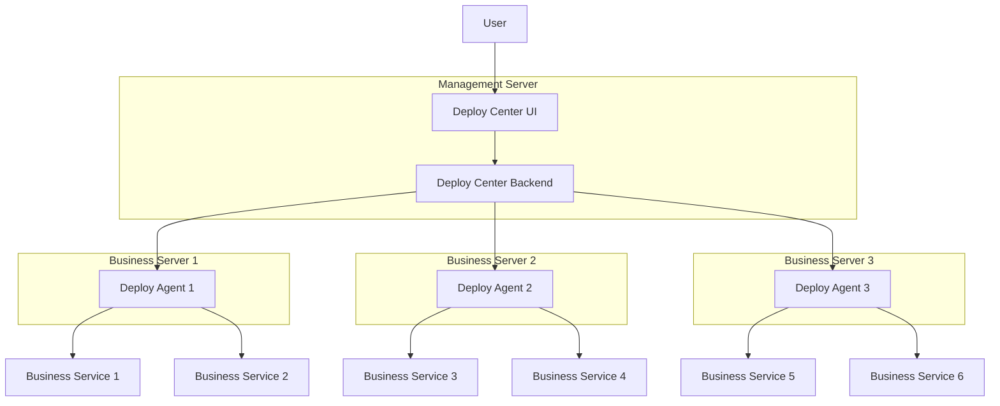

# Deploy Center

  
  
  
  
  

## Introduction

**`Deploy Center`** is a lightweight project deployment management tool that supports front-end projects as well as various projects that can be deployed via Docker containers (such as Java, Python, etc.). By automating and standardizing operations, **Deploy Center** significantly improves operational efficiency, reduces manual intervention costs, and ensures the efficiency and stability of project deployments.

## Features

- **Lightweight and High-Performance**: A single **Deploy Agent** consumes less than 150MB of memory at runtime, ensuring minimal resource usage on business servers while providing high-performance deployment capabilities. It is suitable for deployment scenarios of all sizes, ranging from small and medium-sized enterprises to large enterprises.

- **Flexible Upload and Deployment**: **Deploy Center** offers powerful file management capabilities, allowing users to upload locally packaged project files to the system and complete deployment operations through **Deploy Agent**. The system supports version management of uploaded files, enabling users to conveniently select the desired version for deployment. The entire process is automated, ensuring efficient and controllable deployment.

- **Automated Cloud Build and Deployment**: **Deploy Center** supports automatic code pulls from code repositories (such as GitHub, GitLab) and performs local builds and deployments on business servers using Maven. The entire process is automatically completed by **Deploy Agent** without manual intervention, achieving full automation from code to deployment, significantly simplifying the deployment process and improving development efficiency.

- **Detailed Deployment Logs**: It provides a comprehensive deployment log recording function, allowing users to view detailed information of each deployment process in real-time, including deployment status, executed commands, output information, etc. Logs support multi-dimensional queries by time, project, and more, facilitating quick problem identification and ensuring the transparency and traceability of the deployment process.

- **Complete Deployment History**: It records detailed information of each deployment, including deployment time, version, operator, and results. Users can quickly trace the deployment process through deployment history, compare deployments of different versions, and support one-click rollback to historical versions, ensuring the traceability and stability of deployments.

- **Advanced Security Features**: **Deploy Center** offers advanced security features, including user authentication, permission management, data encryption, and more, ensuring the security of enterprise data and deployment processes. The system supports multi-user login and provides role-based and permission management functions to meet enterprise-level security requirements.

- **Real-Time Monitoring and Alerts**: It provides real-time monitoring capabilities, supporting real-time viewing and analysis of project runtime status. The system can configure alert rules to notify operations personnel of potential issues in a timely manner, ensuring the stable operation of projects.

## Architecture

### Architecture Design Description

#### Deploy Center
- **Deploy Center UI**: Provides a graphical interface for users to send deployment instructions and manage tasks.
- **Deploy Center Backend**: Receives requests from the front end, schedules deployment instructions, and sends commands to each **Deploy Agent**. It is also responsible for security checks across the system.

**Deploy Center** is deployed on a middle server that supports external network access and can receive requests from the external network. It is the management and control center of the entire deployment system, responsible for receiving user instructions, scheduling deployment tasks, and communicating with each **Deploy Agent**.

#### Deploy Agents
- **Project Deployment API**: Deployed on business servers, it exposes APIs to complete project deployment tasks. These APIs cannot be called directly and must be invoked through **Deploy Center** to ensure system security.
- **Business Service Management**: Each business server can deploy multiple types of business services, managed and maintained by **Deploy Agent**.

#### Additional Notes

**Deploy Agent** is a backend service deployed on business servers, responsible for executing specific deployment tasks. It receives instructions from **Deploy Center** to complete service deployment, updates, and management. **Deploy Agent** does not necessarily support external network access and is typically deployed within an internal network, communicating with **Deploy Center** for management.

### Architecture Diagram

## Technology Stack

### Deploy Center

#### Frontend
- **Framework**: Quasar Framework 2 (v2.16.0)
- **Languages**: Vue 3, TypeScript, JavaScript
- **UI Component Library**: Quasar UI, Element Plus
- **Build Tool**: Vite
- **State Management**: Pinia
- **Routing Management**: Vue Router

#### Backend
- **Framework**: FastAPI
- **Language**: Python 3.9+
- **Containerization**: Docker

### Deploy Agent

#### Backend
- **Framework**: FastAPI
- **Language**: Python 3.9+
- **Containerization**: Docker
